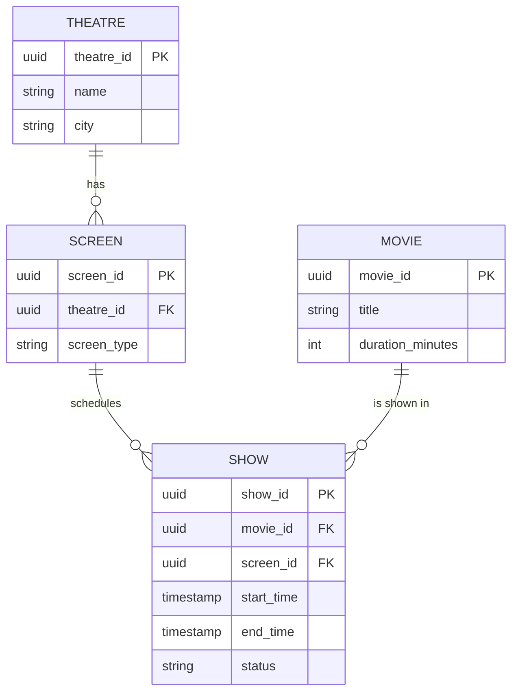
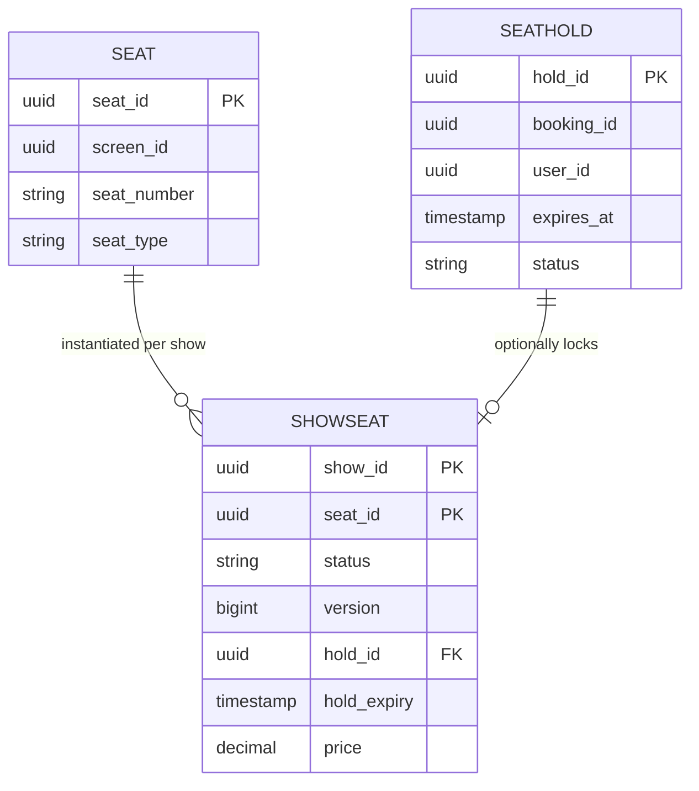
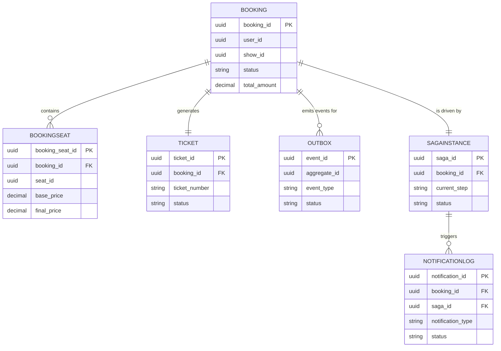
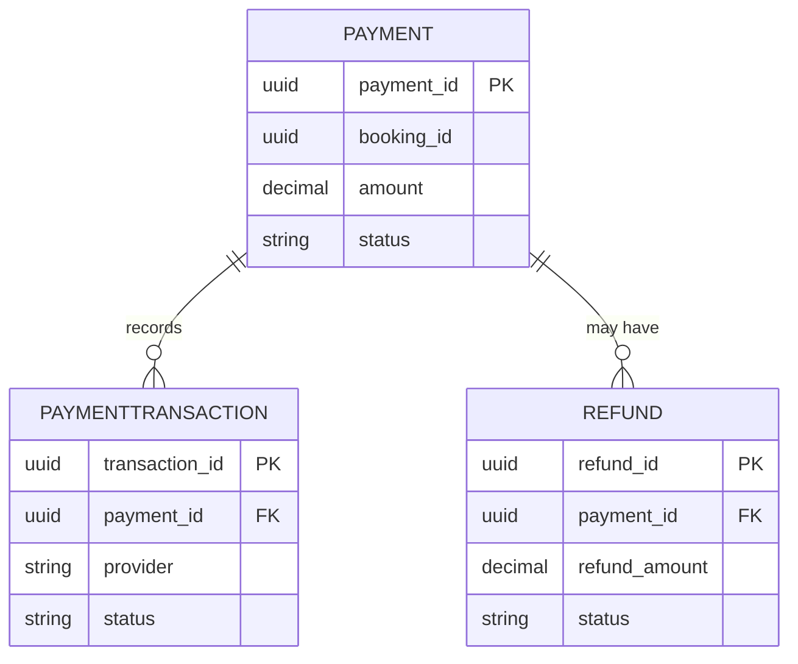
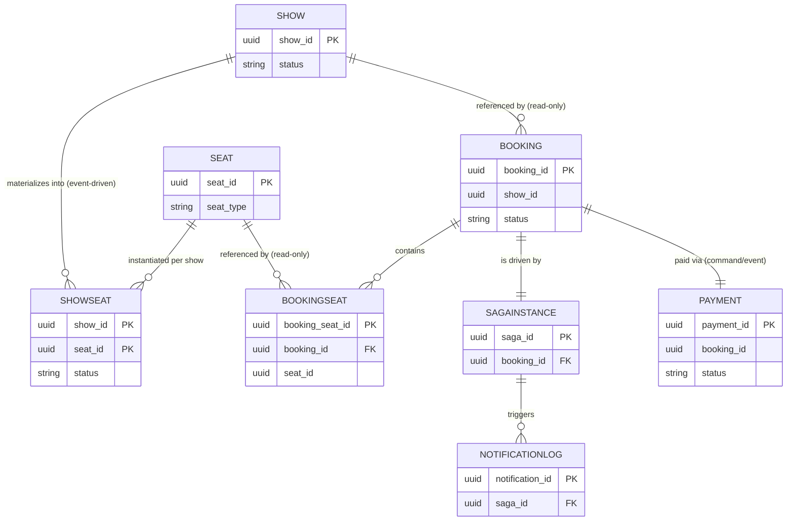

# CineVerse — Database Design & ER Diagrams (Revised Service Boundaries)

This document reflects the revised architecture: **API Gateway** in front of four services — **Catalog**, **Booking** (which now internally owns **Pricing**, **Saga orchestration**, and **Notification**), **Inventory**, and **Payment**. Each service still owns its own database — merging Saga/Notification/Pricing into Booking means they share Booking's database and deployment unit, not that the data model collapses into fewer tables.

> **Why this still respects "5 services, no more":** you've gone from 6 deployable units (Catalog, Booking, Inventory, Payment, Saga Orchestrator, Notification) down to 4 + gateway. Saga and Notification don't need independent scaling or independent failure isolation at this project's scope — they scale and fail together with Booking. If a future version needs Notification to scale independently (e.g. huge fan-out email/SMS volume), it can be extracted later without changing its data model, since it already sits in its own tables.

---

## 1. Database-per-service boundary

| Service | Database | Tables owned |
|---|---|---|
| Catalog Service | `catalog_db` | Movie, Theatre, Screen, Show |
| Inventory Service | `inventory_db` | Seat, ShowSeat, SeatHold |
| **Booking Service** | `booking_db` | Booking, BookingSeat, Ticket, Outbox, **SagaInstance**, **NotificationLog** |
| Payment Service | `payment_db` | Payment, PaymentTransaction, Refund |

**Important:** cross-service references (e.g. `Booking.show_id` pointing at Catalog's `Show.show_id`) are **logical references only** — there is no physical foreign key constraint across databases in a database-per-service architecture. Consistency across these boundaries is maintained by the Saga and by consuming events, not by the database engine. This is worth stating explicitly in interviews — it's a common trip-up question ("how do you enforce referential integrity across services?" — answer: you don't, at the DB level; you enforce it at the application/workflow level, which is exactly what the Saga and invariants document are for).

---

## 2. Catalog Service — `catalog_db`

### Tables & attributes

**Movie**
| Column | Type | Constraints |
|---|---|---|
| movie_id | UUID | PK |
| title | VARCHAR(255) | NOT NULL |
| description | TEXT | |
| duration_minutes | INT | NOT NULL |
| language | VARCHAR(50) | |
| genre | VARCHAR(100) | |
| release_date | DATE | |
| created_at | TIMESTAMPTZ | NOT NULL |
| updated_at | TIMESTAMPTZ | NOT NULL |
| version | INT | NOT NULL DEFAULT 0 |
| is_deleted | BOOLEAN | NOT NULL DEFAULT false |

**Theatre**
| Column | Type | Constraints |
|---|---|---|
| theatre_id | UUID | PK |
| name | VARCHAR(255) | NOT NULL |
| address | VARCHAR(500) | |
| city | VARCHAR(100) | NOT NULL |
| state | VARCHAR(100) | |
| country | VARCHAR(100) | |
| created_at | TIMESTAMPTZ | NOT NULL |
| updated_at | TIMESTAMPTZ | NOT NULL |
| version | INT | NOT NULL DEFAULT 0 |
| is_deleted | BOOLEAN | NOT NULL DEFAULT false |

**Screen**
| Column | Type | Constraints |
|---|---|---|
| screen_id | UUID | PK |
| theatre_id | UUID | FK → Theatre.theatre_id, NOT NULL |
| name | VARCHAR(100) | NOT NULL |
| screen_type | VARCHAR(50) | e.g. IMAX, 2D, 3D |
| created_at | TIMESTAMPTZ | NOT NULL |
| updated_at | TIMESTAMPTZ | NOT NULL |
| version | INT | NOT NULL DEFAULT 0 |
| is_deleted | BOOLEAN | NOT NULL DEFAULT false |

**Show**
| Column | Type | Constraints |
|---|---|---|
| show_id | UUID | PK |
| movie_id | UUID | FK → Movie.movie_id, NOT NULL |
| screen_id | UUID | FK → Screen.screen_id, NOT NULL |
| start_time | TIMESTAMPTZ | NOT NULL |
| end_time | TIMESTAMPTZ | NOT NULL, CHECK (end_time > start_time) |
| status | VARCHAR(30) | SCHEDULED / CANCELLED |
| created_at | TIMESTAMPTZ | NOT NULL |
| updated_at | TIMESTAMPTZ | NOT NULL |
| version | INT | NOT NULL DEFAULT 0 |
| is_deleted | BOOLEAN | NOT NULL DEFAULT false |

**Indexes:** `Movie(title)`, `Movie(release_date)`, `Theatre(city)`, `Theatre(name, city)`, `Screen(theatre_id)`, `Show(movie_id)`, `Show(screen_id, start_time)` — this composite index is what enforces the "no overlapping shows on the same screen" business rule at query time, `Show(start_time)`

### ER diagram

---

## 3. Inventory Service — `inventory_db`

### Tables & attributes

**Seat**
| Column | Type | Constraints |
|---|---|---|
| seat_id | UUID | PK |
| screen_id | UUID | Logical ref → Catalog.Screen.screen_id, NOT NULL |
| row_number | VARCHAR(5) | NOT NULL |
| seat_number | VARCHAR(10) | NOT NULL |
| seat_type | VARCHAR(30) | REGULAR / PREMIUM / RECLINER |
| created_at | TIMESTAMPTZ | NOT NULL |
| updated_at | TIMESTAMPTZ | NOT NULL |

**ShowSeat** (the concurrency-critical table — this is where Q1/Q2 get solved)
| Column | Type | Constraints |
|---|---|---|
| show_id | UUID | PK (composite), logical ref → Catalog.Show.show_id |
| seat_id | UUID | PK (composite), FK → Seat.seat_id |
| status | VARCHAR(30) | NOT NULL — AVAILABLE / HELD / PAYMENT_PENDING / CONFIRMED / EXPIRED |
| version | BIGINT | NOT NULL DEFAULT 0 — optimistic concurrency token |
| hold_id | UUID | Nullable FK → SeatHold.hold_id |
| hold_expiry | TIMESTAMPTZ | Nullable |
| price | DECIMAL(10,2) | NOT NULL |
| created_at | TIMESTAMPTZ | NOT NULL |
| updated_at | TIMESTAMPTZ | NOT NULL |

**SeatHold**
| Column | Type | Constraints |
|---|---|---|
| hold_id | UUID | PK |
| booking_id | UUID | Logical ref → Booking.booking_id, NOT NULL |
| user_id | UUID | NOT NULL |
| created_at | TIMESTAMPTZ | NOT NULL |
| expires_at | TIMESTAMPTZ | NOT NULL |
| status | VARCHAR(30) | ACTIVE / EXPIRED / RELEASED / CONFIRMED |

**Indexes:** `Seat(screen_id)`, `ShowSeat(show_id, status)` — critical for the "list available seats for this show" read path, `ShowSeat(show_id, seat_id)` **UNIQUE**, `SeatHold(expires_at)` — used by the background expiry-sweep scheduler, `SeatHold(booking_id)`

### ER diagram

---

## 4. Booking Service — `booking_db`

This is the merged service: **Booking core + Pricing (fields only, no separate table) + Saga orchestration + Notification.**

### Tables & attributes

**Booking**
| Column | Type | Constraints |
|---|---|---|
| booking_id | UUID | PK |
| user_id | UUID | NOT NULL |
| show_id | UUID | Logical ref → Catalog.Show.show_id, NOT NULL |
| status | VARCHAR(30) | NOT NULL — PENDING / PAYMENT_IN_PROGRESS / CONFIRMED / CANCELLED |
| subtotal | DECIMAL(10,2) | NOT NULL |
| discount_amount | DECIMAL(10,2) | DEFAULT 0 |
| coupon_code | VARCHAR(50) | Nullable |
| coupon_discount | DECIMAL(10,2) | DEFAULT 0 |
| tax_amount | DECIMAL(10,2) | DEFAULT 0 |
| total_amount | DECIMAL(10,2) | NOT NULL |
| created_at | TIMESTAMPTZ | NOT NULL |
| updated_at | TIMESTAMPTZ | NOT NULL |
| version | INT | NOT NULL DEFAULT 0 |

**BookingSeat** — this is where pricing lives as a snapshot, not a separate Pricing table; each row captures the price *at the moment of booking* so later price changes in Inventory don't retroactively affect confirmed bookings
| Column | Type | Constraints |
|---|---|---|
| booking_seat_id | UUID | PK |
| booking_id | UUID | FK → Booking.booking_id, NOT NULL |
| seat_id | UUID | Logical ref → Inventory.Seat.seat_id, NOT NULL |
| seat_type | VARCHAR(30) | NOT NULL |
| base_price | DECIMAL(10,2) | NOT NULL — snapshot from ShowSeat.price at hold time |
| final_price | DECIMAL(10,2) | NOT NULL — after per-seat discount if any |

**Ticket**
| Column | Type | Constraints |
|---|---|---|
| ticket_id | UUID | PK |
| booking_id | UUID | FK → Booking.booking_id, NOT NULL |
| ticket_number | VARCHAR(50) | NOT NULL, UNIQUE |
| issued_at | TIMESTAMPTZ | NOT NULL |
| qr_code | TEXT | NOT NULL |
| status | VARCHAR(30) | ISSUED / CANCELLED |

**Outbox**
| Column | Type | Constraints |
|---|---|---|
| event_id | UUID | PK |
| aggregate_id | UUID | NOT NULL — the booking_id this event is about |
| aggregate_type | VARCHAR(50) | NOT NULL — e.g. "Booking" |
| event_type | VARCHAR(50) | NOT NULL — BookingCreated / BookingConfirmed / BookingCancelled |
| payload | JSONB | NOT NULL |
| status | VARCHAR(30) | NOT NULL — PENDING / PUBLISHED / FAILED |
| retry_count | INT | DEFAULT 0 |
| created_at | TIMESTAMPTZ | NOT NULL |
| published_at | TIMESTAMPTZ | Nullable |

**SagaInstance** — kept intentionally minimal since this is "basic" saga, embedded rather than a standalone orchestrator; still fully durable, which is what actually matters for INV-008/INV-013
| Column | Type | Constraints |
|---|---|---|
| saga_id | UUID | PK |
| booking_id | UUID | FK → Booking.booking_id, NOT NULL, UNIQUE — one saga per booking |
| saga_type | VARCHAR(50) | e.g. "BookingSaga" |
| current_step | VARCHAR(50) | NOT NULL — STARTED / HOLDING_SEAT / PAYMENT_IN_PROGRESS / CONFIRMING_BOOKING / COMPENSATING / COMPLETED / FAILED |
| status | VARCHAR(30) | NOT NULL — IN_PROGRESS / COMPLETED / FAILED |
| retry_count | INT | DEFAULT 0 |
| last_error | TEXT | Nullable |
| started_at | TIMESTAMPTZ | NOT NULL |
| updated_at | TIMESTAMPTZ | NOT NULL |
| completed_at | TIMESTAMPTZ | Nullable |

**NotificationLog** — embedded here because it's triggered directly by saga step transitions (e.g. entering CONFIRMING_BOOKING → success fires a notification), not by an independently-consumed Kafka topic
| Column | Type | Constraints |
|---|---|---|
| notification_id | UUID | PK |
| booking_id | UUID | FK → Booking.booking_id, NOT NULL |
| saga_id | UUID | FK → SagaInstance.saga_id, NOT NULL |
| notification_type | VARCHAR(20) | EMAIL / SMS / PUSH |
| recipient | VARCHAR(255) | NOT NULL |
| status | VARCHAR(30) | PENDING / SENT / FAILED |
| provider_reference | VARCHAR(255) | Nullable |
| retry_count | INT | DEFAULT 0 |
| error_message | TEXT | Nullable |
| created_at | TIMESTAMPTZ | NOT NULL |
| sent_at | TIMESTAMPTZ | Nullable |

**Indexes:** `Booking(user_id)`, `Booking(show_id)`, `Booking(status)`, `BookingSeat(booking_id)`, `Ticket(ticket_number)` UNIQUE, `Outbox(status, created_at)` — this is the query the relay polls on, `SagaInstance(booking_id)` UNIQUE, `NotificationLog(booking_id)`, `NotificationLog(saga_id)`, `NotificationLog(status)`

### ER diagram

---

## 5. Payment Service — `payment_db`

### Tables & attributes

**Payment**
| Column | Type | Constraints |
|---|---|---|
| payment_id | UUID | PK |
| booking_id | UUID | Logical ref → Booking.booking_id, NOT NULL, UNIQUE |
| amount | DECIMAL(10,2) | NOT NULL |
| currency | VARCHAR(10) | NOT NULL DEFAULT 'INR' |
| status | VARCHAR(30) | NOT NULL — PENDING / PROCESSING / SUCCESS / FAILED / REFUNDED |
| provider_reference | VARCHAR(255) | Nullable |
| created_at | TIMESTAMPTZ | NOT NULL |
| updated_at | TIMESTAMPTZ | NOT NULL |
| version | INT | NOT NULL DEFAULT 0 |

**PaymentTransaction**
| Column | Type | Constraints |
|---|---|---|
| transaction_id | UUID | PK |
| payment_id | UUID | FK → Payment.payment_id, NOT NULL |
| provider | VARCHAR(50) | NOT NULL |
| transaction_type | VARCHAR(30) | CHARGE / RETRY / VERIFY |
| provider_reference | VARCHAR(255) | Nullable |
| status | VARCHAR(30) | NOT NULL |
| amount | DECIMAL(10,2) | NOT NULL |
| created_at | TIMESTAMPTZ | NOT NULL |

**Refund**
| Column | Type | Constraints |
|---|---|---|
| refund_id | UUID | PK |
| payment_id | UUID | FK → Payment.payment_id, NOT NULL |
| refund_amount | DECIMAL(10,2) | NOT NULL |
| status | VARCHAR(30) | NOT NULL — PENDING / SUCCESS / FAILED |
| provider_reference | VARCHAR(255) | Nullable |
| created_at | TIMESTAMPTZ | NOT NULL |

**Indexes:** `Payment(booking_id)` UNIQUE, `Payment(status)`, `Payment(provider_reference)`, `PaymentTransaction(payment_id)`, `PaymentTransaction(provider_reference)`, `Refund(payment_id)`

### ER diagram

---

## 6. Cross-service logical relationships (no physical FKs)

| From | To | Nature | Consistency mechanism |
|---|---|---|---|
| `Booking.show_id` | `Catalog.Show.show_id` | Read reference | Booking reads Catalog synchronously (or from a cached projection) when creating a booking; never writes to Catalog |
| `BookingSeat.seat_id` | `Inventory.Seat.seat_id` | Read reference | Same — read-only, price is snapshotted into `BookingSeat` at hold time so later Inventory changes don't retroactively affect this booking |
| `Inventory.ShowSeat.show_id` | `Catalog.Show.show_id` | Event-driven | Inventory consumes `ShowCreated` from Catalog and materializes `ShowSeat` rows — this is why Inventory doesn't need a live call to Catalog on every seat query |
| `Inventory.SeatHold.booking_id` | `Booking.booking_id` | Command/event | Saga (inside Booking) issues the hold command to Inventory and correlates by booking_id |
| `Payment.booking_id` | `Booking.booking_id` | Command/event | Saga issues payment command to Payment Service, correlates by booking_id; unique constraint on `Payment.booking_id` is your idempotency guard for INV-010 (one logical payment per booking) |

This table is worth keeping in the repo alongside the invariants doc — it's the direct answer to "how do you maintain referential integrity in a database-per-service system," which is one of the more common follow-up questions this architecture invites.

---

## 7. Full cross-service overview

Note: this diagram intentionally draws logical/dashed-equivalent relationships (show_id, seat_id references) the same as structural FKs for readability — in your actual repo docs, it's worth calling out in prose (as section 6 does above) which of these are enforced by the database and which are enforced by the workflow.
